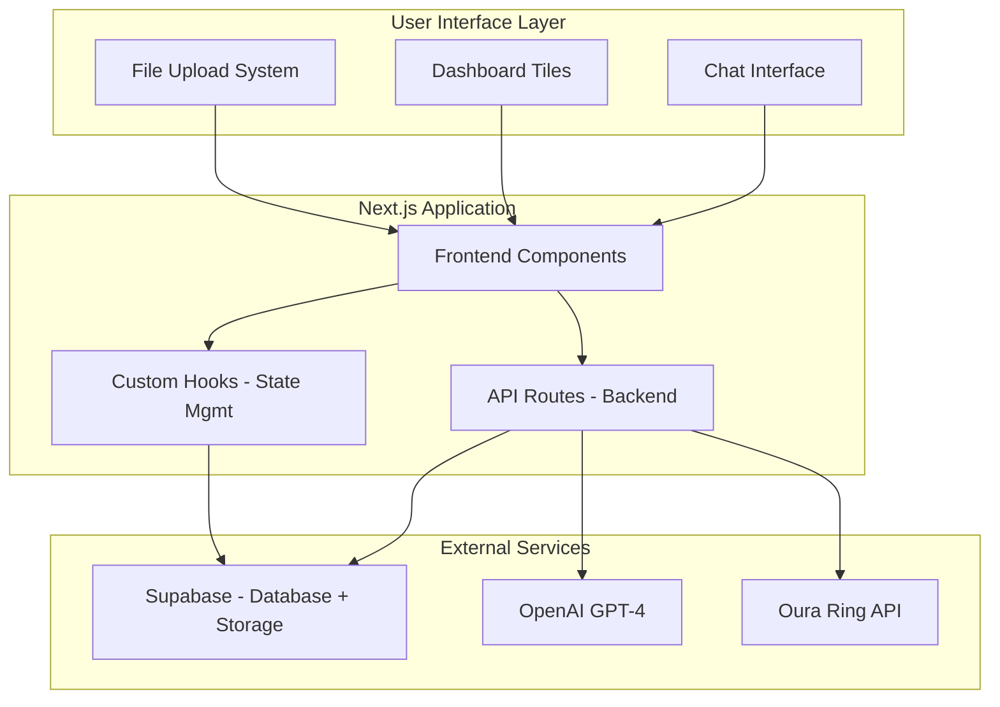
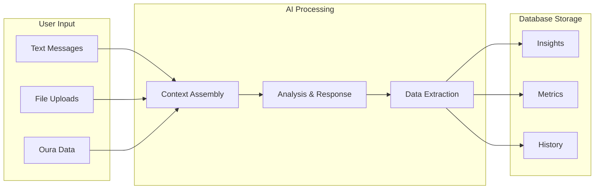
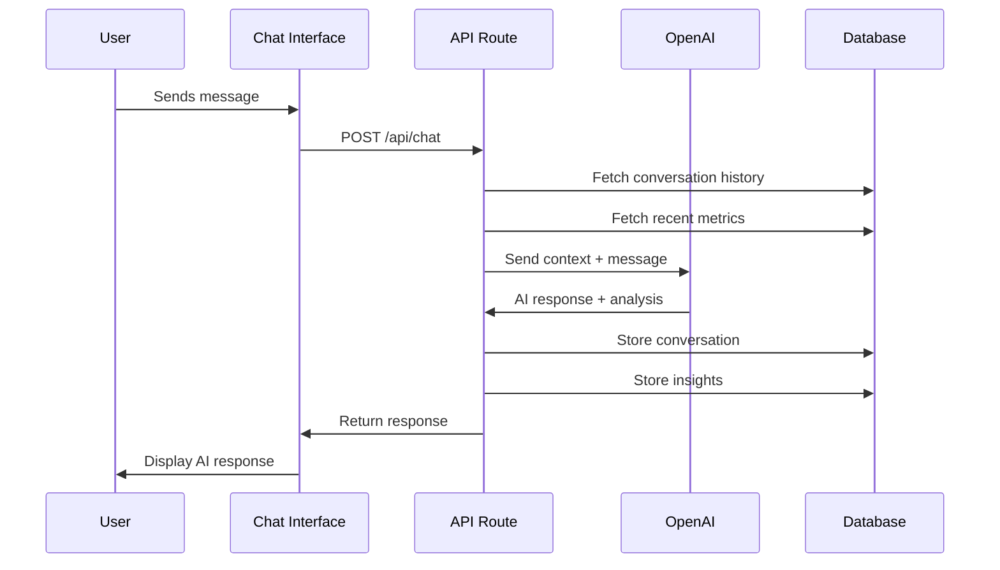
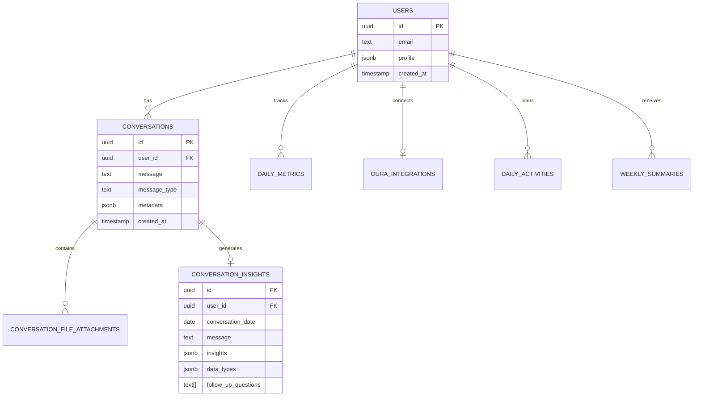
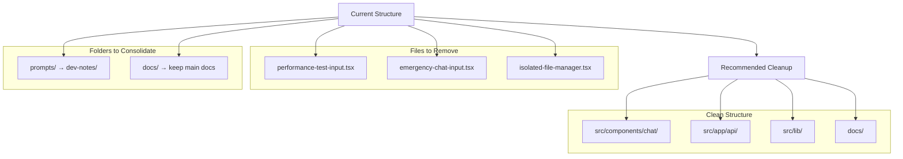

# Coach App - Comprehensive Code Walkthrough

## Table of Contents
1. [App Overview & Core Value](#app-overview--core-value)
2. [Architecture Overview](#architecture-overview)
3. [How Everything Connects](#how-everything-connects)
4. [AI Context Gathering System](#ai-context-gathering-system)
5. [Core Features Deep Dive](#core-features-deep-dive)
6. [Data Flow & Database Design](#data-flow--database-design)
7. [File Structure Analysis](#file-structure-analysis)
8. [Authentication Flow](#authentication-flow)
9. [Development Insights](#development-insights)

---

## App Overview & Core Value

**Coach** is an AI-powered health and fitness companion that adapts to your unique personality and needs. The core value proposition is that you can talk to your coach about anything, and it will:

- **Follow your lead** - The AI doesn't force rigid health tracking
- **Adapt to your personality** - Learns your communication style and preferences  
- **Focus on health and longevity** - Always encouraging and supportive
- **Gather context naturally** - From conversations, files, and connected devices

### Key Differentiators
- **Conversational AI** that feels natural, not clinical
- **Multi-modal input** - text, images, documents, health device data
- **Context-aware** - Remembers your patterns and preferences
- **Adaptive coaching** - Adjusts to your unique needs and goals

---

## Architecture Overview

### High-Level System Architecture



### Technology Stack
- **Frontend**: Next.js 15 + React 19 + TypeScript
- **Backend**: Next.js API Routes (serverless functions)
- **Database**: PostgreSQL via Supabase with Row Level Security
- **AI**: OpenAI GPT-4 for conversation and analysis
- **Storage**: Supabase Storage for files
- **Health Data**: Oura Ring API integration
- **Styling**: Tailwind CSS + Radix UI components

---

## How Everything Connects

### 1. User Journey Flow
```
User Login → Dashboard → Chat Interface → AI Processing → Context Storage → Personalized Response
```

### 2. Data Integration Points



### 3. Component Connection Map
```
App Layout (Root)
├── AuthProvider (Authentication Context)
├── Dashboard Page
│   ├── DashboardClient (Main Container)
│   ├── DashboardHeader (User Info)
│   ├── SimpleTile Components (Health Metrics)
│   └── ChatInterface (Main Feature)
│       ├── ChatMessage (Message Display)
│       ├── OptimizedInput (Text Input)
│       ├── FileUploadMenu (File Handling)
│       └── FilePreviewChip (File Display)
└── UI Components (Reusable Elements)
```

---

## AI Context Gathering System

This is the heart of your app - how the AI becomes truly personalized and adaptive.

### Context Sources
The AI gathers context from multiple sources to understand you better:

1. **Conversation History** - Your chat patterns and preferences
2. **Health Metrics** - Daily tracking data and trends
3. **File Uploads** - OCR from images, content from documents
4. **Oura Integration** - Sleep, activity, and readiness data
5. **User Preferences** - Timezone, metric preferences, goals

### Context Building Process
```typescript
// From /src/app/api/chat/route.ts - How context is built
const systemPrompt = [
  baseSystemPrompt,           // "You are Coach, an AI health companion..."
  limitedUserContext,         // Recent health metrics and trends
  limitedStateContext,        // Current conversation state
  ocrSection,                 // File upload data
  multiFileSection           // Document content
].filter(Boolean).join('\n\n')
```

### AI Processing Pipeline



**Step 1: Context Assembly**
- Fetches last 6 conversation messages
- Gets recent health metrics (last 2 days)
- Includes file upload data (OCR, documents)
- Adds user preferences and timezone

**Step 2: AI Analysis**
- Sends context + message to OpenAI GPT-4
- AI analyzes for health insights
- Generates personalized response
- Extracts structured data from conversation

**Step 3: Data Storage**
- Saves conversation to database
- Stores extracted insights
- Links file attachments
- Triggers daily narrative generation

### Conversation Analysis
The AI doesn't just respond - it actively learns from every conversation:

```typescript
// From parseConversationForRichContext function
interface ParsedConversation {
  has_health_data: boolean
  has_activity_data: boolean
  has_mood_data: boolean
  has_nutrition_data: boolean
  has_sleep_data: boolean
  has_workout_data: boolean
  insights: string[]                    // What the user shared
  follow_up_questions: string[]         // Natural follow-ups
}
```

This analysis helps the AI:
- **Remember** what you've shared before
- **Connect** patterns across conversations
- **Adapt** its coaching style to your needs
- **Suggest** relevant follow-up questions

---

## Core Features Deep Dive

### 1. Chat Interface (`/src/components/chat/`)

**Main Components:**
- `chat-interface.tsx` - Main chat UI with message history
- `optimized-input.tsx` - Text input with file upload support
- `file-upload-menu.tsx` - File selection and upload handling
- `file-preview-chip.tsx` - Display uploaded files

**Key Features:**
- **Real-time messaging** with conversation history
- **Multi-file upload** (up to 10 files: images, PDFs, docs, spreadsheets)
- **OCR processing** for workout screenshots and health data
- **Document parsing** for various file formats
- **Drag & drop** file upload interface

**Performance Optimizations:**
- `emergency-chat-input.tsx` - Fallback for typing lag issues
- `performance-test-input.tsx` - Isolated testing component
- `isolated-file-manager.tsx` - Separate file management to prevent input lag

### 2. Dashboard System (`/src/app/dashboard/`)

**Main Components:**
- `dashboard-client.tsx` - Main dashboard container
- `dashboard-header.tsx` - User info and navigation
- `simple-tile.tsx` - Reusable metric display tiles
- `workout-card.tsx` - Activity tracking cards

**Key Features:**
- **Personalized health metrics** display
- **Activity tracking** and planning
- **Weekly summaries** and trends
- **Goal setting** and progress tracking
- **Timezone-aware** date handling

### 3. File Processing System (`/src/lib/file-processing/`)

**Processing Pipeline:**
```
File Upload → Type Detection → Content Extraction → AI Analysis → Database Storage
```

**Supported Formats:**
- **Images**: PNG, JPG, JPEG (OCR processing via Supabase Edge Functions)
- **Documents**: PDF, DOC, DOCX, TXT, MD
- **Spreadsheets**: CSV, XLSX, ODS
- **Presentations**: PPTX

**Technical Implementation:**
- **Client-side**: File validation and preview
- **Server-side**: Content extraction and processing
- **AI Integration**: Context-aware analysis of extracted content
- **Storage**: Supabase Storage with metadata tracking

### 4. Oura Integration (`/src/lib/oura/`)

**Integration Points:**
- **OAuth Flow**: Secure token management
- **Data Sync**: Automatic sleep, activity, and readiness data
- **Pattern Analysis**: AI analysis of health trends
- **Personalization**: Adapts coaching based on Oura data

**Data Flow:**
```
Oura Ring → Oura API → Supabase → AI Analysis → Personalized Insights
```

---

## Data Flow & Database Design

### Core Database Tables

**User Management:**
```sql
users                    -- User profiles and preferences
oura_integrations        -- Oura Ring API tokens
oura_data               -- Raw Oura data storage
```

**Conversation System:**
```sql
conversations           -- Chat messages (raw)
conversation_insights   -- AI-extracted insights
conversation_file_attachments -- File links to conversations
```

**Structured Metrics:**
```sql
metric_categories       -- Health metric categories (sleep, fitness, etc.)
standard_metrics        -- Individual metrics within categories
user_daily_metrics      -- User's daily metric values
user_metric_preferences -- Which metrics user wants to track
```

**Activity & Analysis:**
```sql
daily_activities        -- Planned and completed activities
daily_journal          -- AI-generated tips and notes
weekly_summaries       -- AI-generated weekly summaries
monthly_trends         -- Long-term pattern analysis
```

### Data Relationships



### Row Level Security (RLS)
Every table has RLS policies ensuring users can only access their own data:
```sql
-- Example RLS policy
CREATE POLICY "Users can manage own conversations" 
ON conversations FOR ALL 
USING (user_id = auth.uid());
```

---

## File Structure Analysis

### Clean Architecture
Your codebase follows a clean, logical structure:

```
src/
├── app/                    # Next.js App Router (Pages & API)
│   ├── api/               # Backend API endpoints
│   ├── auth/              # Authentication flows
│   └── dashboard/         # Main dashboard interface
├── components/            # React UI components
│   ├── auth/             # Login/signup components
│   ├── chat/             # Chat interface & file upload
│   ├── dashboard/        # Dashboard tiles & cards
│   └── ui/               # Reusable UI components
├── hooks/                 # Custom React hooks
├── lib/                   # Utility libraries & services
└── types/                 # TypeScript type definitions
```

### Identified Extraneous Files
I found a few files that appear to be development/testing artifacts:

**Performance Testing Files (Can be removed):**
- `src/components/chat/performance-test-input.tsx` - Isolated performance testing
- `src/components/chat/emergency-chat-input.tsx` - Fallback for typing lag  
- `src/components/chat/isolated-file-manager.tsx` - Performance optimization

**Documentation Files (Consider consolidating):**
- `prompts/` folder - Contains 9 markdown files with development notes
- `docs/` folder - Contains 4 markdown files with implementation details

**Recommendation:** These files can be safely removed or moved to a `dev-notes/` folder to keep the main codebase clean.

### File Structure Cleanup Recommendations



### Well-Organized Areas
- **API Routes**: Clear separation by feature (`/api/chat`, `/api/files`, `/api/metrics`)
- **Components**: Logical grouping by functionality
- **Hooks**: Reusable state management logic
- **Lib**: Utility functions and external service integrations

---

## Authentication Flow

### Supabase Auth Integration
Your app uses Supabase Auth for a complete authentication solution:

**Flow:**
```
1. User visits app → AuthProvider checks session
2. If not authenticated → Redirect to login page
3. User logs in → Supabase handles authentication
4. Session established → Redirect to dashboard
5. All API routes check authentication → Access granted/denied
```

**Key Components:**
- `src/components/providers/auth-provider.tsx` - Authentication context
- `src/components/auth/auth-form.tsx` - Login/signup form
- `src/app/auth/callback/route.ts` - OAuth callback handling

**Security Features:**
- **JWT Tokens**: Secure session management
- **Row Level Security**: Database-level access control
- **API Protection**: Server-side authentication checks
- **OAuth Integration**: Oura Ring OAuth flow

---

## Development Insights

### Key Patterns Used

**1. Custom Hooks Pattern**
```typescript
// Example: useCardModal.ts
export function useCardModal() {
  const [isOpen, setIsOpen] = useState(false)
  const [cardData, setCardData] = useState(null)
  // ... hook logic
  return { isOpen, setIsOpen, cardData, setCardData }
}
```

**2. Context Pattern**
```typescript
// AuthProvider wraps the entire app
<AuthProvider>
  {children}
</AuthProvider>
```

**3. API Route Pattern**
```typescript
// Each API route is a serverless function
export async function POST(request: NextRequest) {
  // Handle POST requests
}
```

**4. Component Composition**
```typescript
// Reusable components with clear interfaces
<SimpleTile 
  title="Sleep Hours" 
  value={sleepHours} 
  trend={trend}
  onClick={handleClick}
/>
```

### Performance Considerations

**Optimizations Implemented:**
- **Token Management**: Strict limits to prevent OpenAI token overflow
- **Context Truncation**: Limits conversation history and context size
- **Emergency Mode**: Fallback for large contexts
- **File Processing**: Hybrid client/server processing
- **Database Indexing**: Optimized queries with proper indexes

**Areas for Improvement:**
- **Caching**: Could implement Redis for frequently accessed data
- **Image Optimization**: Could add image compression
- **Code Splitting**: Could implement lazy loading for components

### Error Handling Strategy

**Comprehensive Error Handling:**
- **API Routes**: Try-catch blocks with detailed logging
- **Database Operations**: Error handling with fallbacks
- **File Processing**: Graceful degradation for unsupported files
- **AI Integration**: Fallback responses when AI fails

---

## Key Takeaways

### What Makes This App Special

1. **Adaptive AI**: The AI truly learns and adapts to each user's personality and needs
2. **Multi-Modal Input**: Seamlessly handles text, images, documents, and health device data
3. **Context-Aware**: Remembers patterns and provides personalized insights
4. **Clean Architecture**: Well-organized codebase with clear separation of concerns
5. **Performance Focused**: Multiple optimizations to ensure smooth user experience

### For Your Learning Journey

**Start Here:**
1. **Chat Interface** (`/src/components/chat/chat-interface.tsx`) - Main user interaction
2. **API Route** (`/src/app/api/chat/route.ts`) - Backend processing
3. **Database Schema** (`/src/lib/supabase/schema.sql`) - Data structure
4. **AI Integration** - How context is built and used

**Next Steps:**
1. **Add a new metric category** - Extend the metrics system
2. **Create a new dashboard tile** - Build a custom component
3. **Implement file type validation** - Add security checks
4. **Optimize a database query** - Improve performance

### Architecture Strengths

- **Scalable**: Serverless architecture can handle growth
- **Secure**: Row Level Security and proper authentication
- **Maintainable**: Clear separation of concerns and TypeScript
- **Extensible**: Easy to add new features and integrations
- **Performance**: Multiple optimizations for smooth experience

This codebase demonstrates modern web development best practices with a sophisticated AI integration that creates a truly personalized user experience. The architecture is clean, scalable, and well-thought-out for long-term maintenance and growth.
